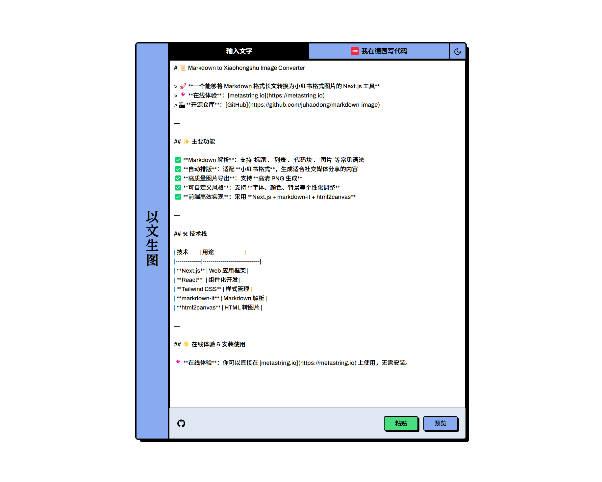

# Markdown to Xiaohongshu Image Converter


## 简介

本项目是一个基于 **Next.js** 开发的小工具，能够将 **Markdown 格式的长文** 转换为适用于 **小红书** 平台的图片格式，方便内容创作者分享和传播。

## 功能特性

- 支持 Markdown 语法解析（标题、列表、代码块等）
- 自动排版并适配小红书的展示格式
- 一键生成适用于小红书的高清图片
- 支持自定义字体、颜色、背景样式
- 采用 **Next.js** 前端框架，响应式设计，适用于多种设备



## 技术栈

- **Next.js** - 前端框架
- **React** - 组件化开发
- **Tailwind CSS** - 样式管理
- **markdown-it** - Markdown 解析
- **html2canvas** - HTML 转图片

## 在线体验

本工具已部署至 **[metastring.io](https://metastring.io)**，可直接在线使用。

## 代码仓库

本项目的代码托管于 GitHub，欢迎访问并贡献代码：
**[GitHub 仓库](https://github.com/juhaodong/markdown-image)**

## 安装与运行

### 1. 克隆项目
```sh
git clone https://github.com/juhaodong/markdown-image.git
cd markdown-image
```

### 2. 安装依赖
```sh
yarn install  # 或者 npm install
```

### 3. 启动开发服务器
```sh
yarn dev  # 或者 npm run dev
```

然后在浏览器中打开 `http://localhost:3000` 进行访问。

## 使用方法

1. 在输入框粘贴或编写 Markdown 内容。
2. 选择排版样式（背景颜色、字体等）。
3. 点击“生成图片”按钮。
4. 下载生成的适用于小红书的图片。

## 贡献指南

如果你对这个项目感兴趣，欢迎贡献代码或提出建议！

### 贡献方式
- **Fork 本仓库**，然后创建你的分支：`git checkout -b feature/your-feature`
- **提交修改** 并推送到远程分支：`git commit -m '添加了某某功能'` → `git push origin feature/your-feature`
- **创建 Pull Request**，我们会尽快 review！

## 许可证

本项目采用 MIT 许可证，你可以自由使用、修改和分发。

---

欢迎反馈问题或建议！🚀
